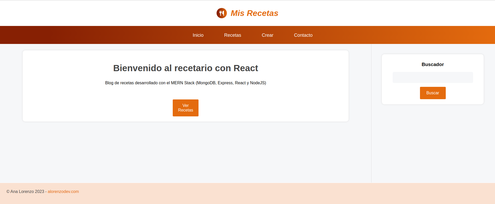

# Aplicación Web Full Stack - MERN Stack

Este es el archivo README que describe una aplicación web Full Stack desarrollada utilizando la MERN Stack, que consiste en MongoDB como base de datos, Express.js y Node.js en el backend, y React.js en el frontend.

## Descripción de la Aplicación

La aplicación web es un sistema de recopilación de recetas de cocina. Tiene una interfaz de usuario intuitiva y receptiva, lo que facilita la navegación por la misma.

Los usuarios pueden crear nuevas recetas, ver una lista de las ya creadas, editarlas y borrarlas. También cuenta con una barra de busqueda por palabras.

## Tecnologías Utilizadas

La aplicación web se ha desarrollado utilizando las siguientes tecnologías:

### Frontend

- React.js
- React Router Dom
- Hooks y Hooks personalizados

### Backend

- Node.js
- Express.js
- MongoDB
- Mongoose

## Instalación y Uso

A continuación, se detallan los pasos para instalar y ejecutar la aplicación web:

1. Clona este repositorio en tu máquina local.
2. Abre una terminal y navega hasta el directorio raíz del proyecto.
3. Instala las dependencias del backend ejecutando el siguiente comando: `npm install`.
4. Ejecuta `npm install` para instalar las dependencias del frontend.
5. Ejecuta `npm run dev` para iniciar tanto el servidor backend como el cliente frontend.
6. Accede a la aplicación abriendo tu navegador y navegando a tu localhost.

**Nota:** Asegúrate de tener MongoDB instalado y en ejecución en tu máquina local antes de ejecutar la aplicación. Además de acceso a la BBDD.

